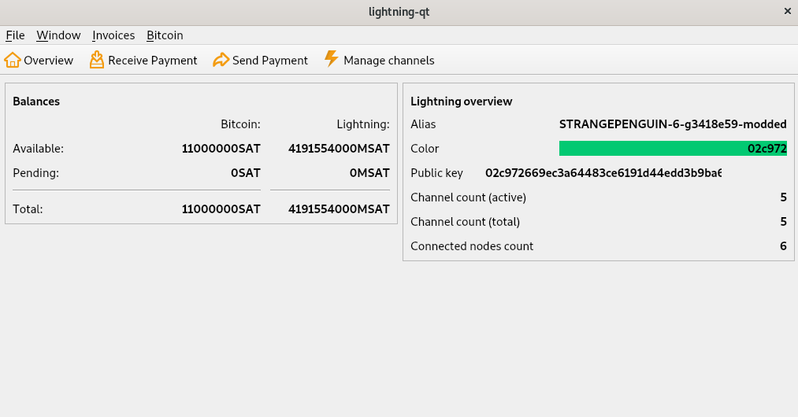

# pylightning-qt
*bitcoin-qt for C-Lightning, as simple as : `lightning-cli gui`*

  
## What is it ?
lightning-qt is a Python plugin for [C-lightning](https://github.com/ElementsProject/lightning), a [Lightning Network](https://github.com/bitcoin/bitcoin/tree/master/src/qt) daemon. It enables the use of a [bitcoin-qt](https://github.com/bitcoin/bitcoin/tree/master/src/qt)-like Graphical User Interface (actually, part of the icons and forms have been taken from bitcoin-qt and modified) via the RPC interface.  
  
## Why ?
Currently lightning does not have a GUI, and I think that having one which looks like bitcoin-qt is great for people coming from [bitcoin-core](https://github.com/bitcoin/bitcoin), which most of the C-Lightning users do (or have at least ever used bitcoin-qt). Having it directly available from the RPC is also quite convenient.  
  
## How to install it ?
The easiest way is to install it with [bug](https://github.com/darosior/bug) :-). If you have `lightningd` running with [the bug plugin](https://github.com/darosior/bug) loaded you can install `lightning-qt` with :
```bash
lightning-cli install_plugin lightning-qt
```
Otherwise the traditional solution :  
```bash
git clone https://github.com/darosior/lightning-qt && cd lightning-qt
pip3 install -r requirements.txt
chmod a+x lightning-qt.py
# And just start lightningd like
lightningd --plugin=lightning-qt.py
```
You can also add `lightning-qt` directly in the default `plugins` directory so that it is automatically loaded on startup :
```bash
git clone https://github.com/darosior/lightning-qt ~/.lightning/plugins/lightning-qt
python3 -m pip install ~/.lightning/plugins/lightning-qt/requirements.txt
chmod a+x ~/.lightning/plugins/lightning-qt/lightning-qt.py
lightningd
```
Or you can even start it dynamically like (C-lightning v0.7.2 and above) :
```bash
git clone https://github.com/darosior/lightning-qt && cd lightning-qt
pip3 install -r requirements.txt
chmod a+x lightning-qt.py
# And just start lightningd like
lightning-cli plugin start lightning-qt.py
```
For more informations about plugins and their installations you can checkout the [lightningd/plugins](https://github.com/lightningd/plugins) repository (which has a great list of plugins too).

## How to use it ?
Just launch `lightning-cli gui` :D.  
You can now also use lightning-qt in standalone mode. It will connect to a socket which path can be given as a command line option (and defaults to $HOME/.lightning/lightning-rpc) : this can be useful to use lightning-qt as a remote control for your lightning node hosted on another computer, you could for example share a socket through ssh and start lightning-qt listening on this socket i.e.  
```bash
python3 lightning-qt --socket-path /path/to/unixdomain/socket
```
  
  
## Contributing
Any contribution (issue, PR) is welcome.
We use [forms](forms/)(ui files) to design pages : these are handled by PyQt5 with the `pyuic5` command line tool (installed with `pip install PyQt5`). If you modify a ui file (you may want to use [QDesigner](https://doc.qt.io/qt-5/qtdesigner-manual.html)), you can regenerate the Python code like :
```shell
pyuic5 forms/channelspage.ui -o forms/ui_channelsPage.py
```
Images are handled in the [qrc](gui.qrc) file : if you modify this resource file (for instance to add an image/icon), you can regenerate the Python code with :
```shell
pyrcc5 gui.qrc -o resources.py
```
Also, if you help me on this project you may want to use the very handy [auto-reload plugin](https://github.com/lightningd/plugins/tree/master/autoreload). Please also note that PyQt5 has *__a very bad__* way to handle exception in slots : in short you cannot `except` a raised exception in a [slot](https://doc.qt.io/qt-5/signalsandslots.html), so be carefull and happy debuging ;).  
   
## Licence
BSD 3-clauses clear
